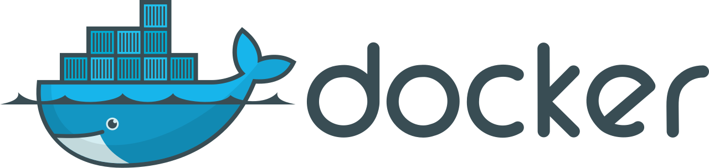
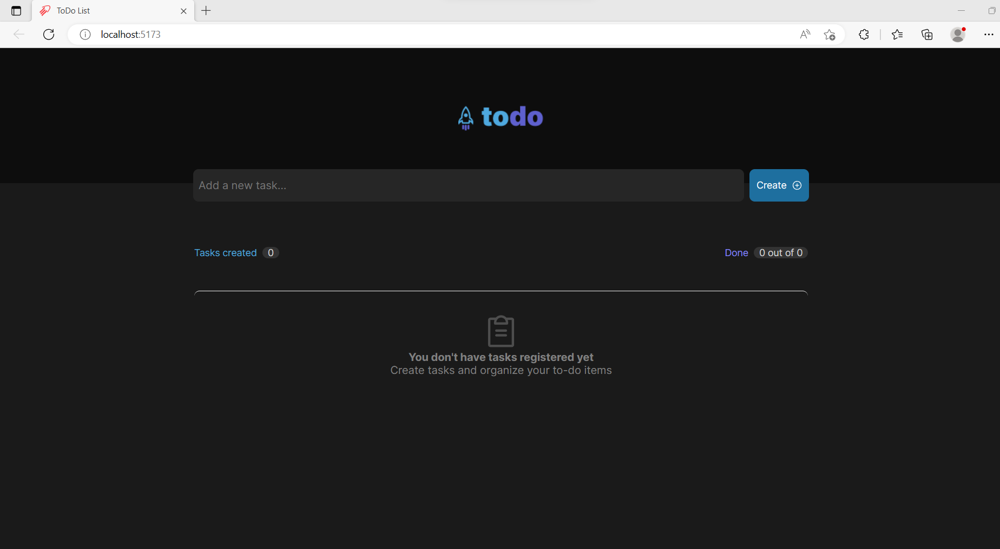
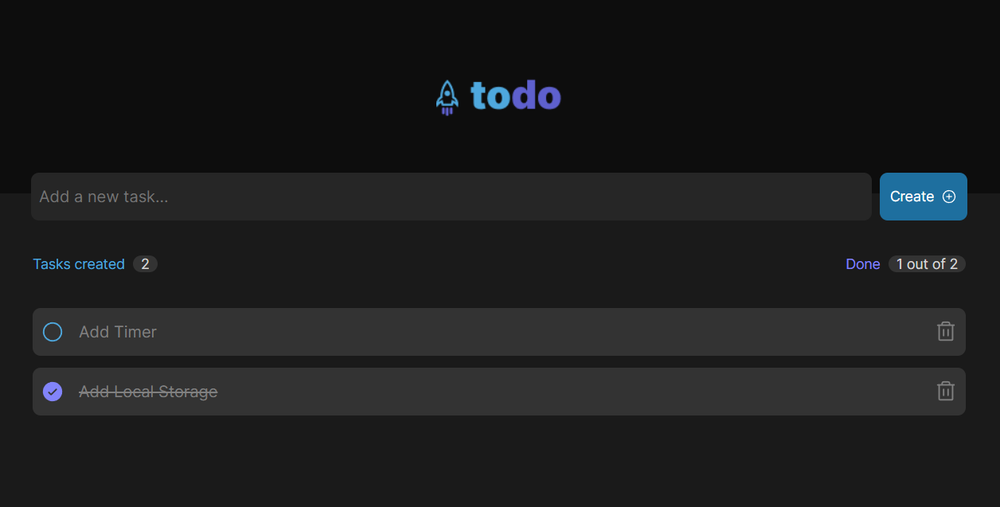

# DS Vendas
 

# About the project

This is a Todo app built using React and TypeScript. The application allows users to manage their daily tasks and track their progress, in addition to being able to control the time spent on each task.

## Features

- Add new tasks
- Mark tasks as completed
- Delete tasks
- Time control
- Responsive design for seamless usage across different devices

## Docker

 
   
  
docker run -d -p 5173:5173 --name Todo edmilsonemandrade/typescript-react-todo

   
  After running the Docker image, go to: => <a href="http://localhost:5173/" target="_blank">Project ToDo</a>

## Website images

# Technologies used
- Typescript
- React
- Node
- HTML
- CSS
- Docker

# How to run the project

## Prerequisites
<a href="https://nodejs.org/en" target="_blank">Node</a>

## Command
- npm i
- npm run dev
- go to: => <a href="http://localhost:5173/" target="_blank">Project ToDo</a>

# Author
<a href="https://www.linkedin.com/in/eemandrade/" target="_blank">Edmilson Emmanuel Moura Andrade</a>